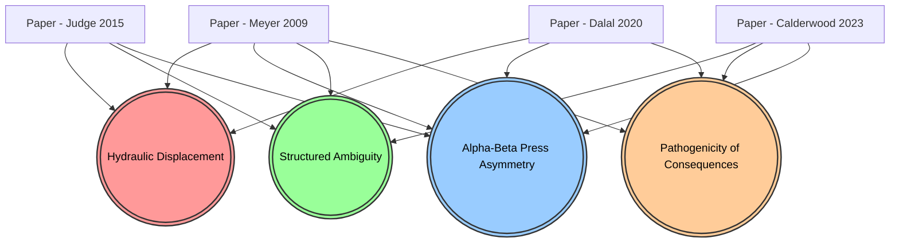

# 지식망 연결 구조 분석 (Graph Topology Analysis)

## 1. 지식망 전체 조감도 (Mermaid Visualization)
아래의 다이어그램은 4편의 개별 논문(사각형)이 어떻게 4개의 거대 허브 개념(타원)을 통해 의미론적으로 교차하고 있는지 보여주는 실제 옵시디언 볼트의 연결망 구조입니다.

---

## 2. 핵심 연결 경로(Pathways) 심층 해부

단순히 선이 이어진 것이 아니라, **"왜 이 논문들이 특정 허브를 통해 이어지는가?"**에 대한 학술적 경로(Pathway) 분석입니다.

### 🔴 경로 A: [수압 프레스 효과] 라우팅 (Hydraulic Displacement)
* **연결 흐름:** `[Meyer 2009]` ➡️ **((Hydraulic Displacement))** ⬅️ `[Dalal 2020]` & `[Judge 2015]`
* **분석:** 이 경로는 '제약(Constraints)'이 어떻게 '부작용'으로 변질되는지를 보여주는 핵심 통로입니다. **Meyer**가 성과를 높이기 위해 강력한 통제를 가하면, **Judge**가 주장하는 인간의 고유한 특성(Big 5)이 발현되지 못하고 억눌립니다. 이 억눌린 에너지가 증발하는 것이 아니라, **Dalal**이 경고한 '부정적 감정(Negative Affect)'으로 변질되어 결국 사내 정치나 태업 같은 사보타주(CWB)로 터져 나갑니다. 즉, 세 논문이 '통제 ➡️ 억압 ➡️ 폭발'이라는 하나의 인과율로 완벽하게 묶였습니다.

### 🔵 경로 B: [알파-베타 프레스 비대칭] 라우팅 (Alpha-Beta Press Asymmetry)
* **연결 흐름:** `[Meyer 2009]` & `[Judge 2015]` ➡️ **((Alpha-Beta Press Asymmetry))** ⬅️ `[Dalal 2020]` & `[Calderwood 2023]`
* **분석:** 이 경로는 통계와 감정의 충돌 지점입니다. **Meyer**와 **Judge**는 모두 직업의 구조적 데이터(O*NET)라는 '객관적 지표(Alpha Press)'를 맹신하는 한계를 가집니다. 그러나 이들의 이론이 현장에 적용될 때 발생하는 오류를, **Dalal**과 **Calderwood**가 직원의 '주관적 감정과 스트레스(Beta Press)'를 측정하여 붕괴시킵니다. 이 허브는 과거의 객관적 거시 모델이 현대의 주관적 미시 모델에 의해 어떻게 논박당하는지를 보여주는 무덤이자 교차로입니다.

### 🟢 경로 C: [구조화된 모호성] 라우팅 (Structured Ambiguity)
* **연결 흐름:** `[Judge 2015]` ➡️ **((Structured Ambiguity))** ⬅️ `[Calderwood 2023]` & `[Meyer 2009]`
* **분석:** 미래의 조직 설계가 지나가는 필수 경로입니다. **Judge**는 개인의 능력을 100% 발휘하려면 제약이 없는 '자율적(약한) 상황'이 필요하다고 주장합니다. 하지만 **Calderwood**는 원격 근무처럼 룰이 너무 없으면 직원이 불안감과 인지적 과부하(번아웃)로 쓰러진다고 반박합니다. 이들의 충돌은 이 허브에서 **"제약(Constraints)은 없애되, 명확성(Clarity)은 극대화한다"**는 궁극의 타협점(구조화된 모호성)으로 융합됩니다.

### 🟠 경로 D: [결과 중심 통제의 병리적 부작용] 라우팅 (Pathogenicity of Consequences)
* **연결 흐름:** `[Meyer 2009]` ➡️ **((Pathogenicity of Consequences))** ⬅️ `[Dalal 2020]` & `[Calderwood 2023]`
* **분석:** 처벌과 감시의 파멸적 결과를 경고하는 경로입니다. **Meyer**가 성과 관리를 위해 내세운 '가혹한 결과(Consequences)'와 감시 체계가 어떻게 조직을 병들게 하는지 보여줍니다. 이 처벌에 대한 두려움은 **Dalal**의 모델에서는 급성 분노(Reactance)로 나타나고, **Calderwood**의 원격 근무 모델에서는 퇴근 후에도 감시당한다는 만성적인 '팬텀 판옵티콘(Phantom Panopticon)' 현상으로 이어져 궁극적인 번아웃을 유발합니다. 

---
**결론:**
옵시디언 볼트 내의 이 4개 허브 노드는 4편의 논문이 가진 각기 다른 파편적 주장들을 인과관계(원인 ➡️ 부작용 ➡️ 대안)로 완벽하게 꿰매어, 하나의 거대하고 유기적인 인공지능(HR) 뇌로 작동하게 만듭니다.
